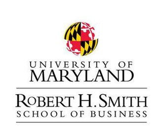
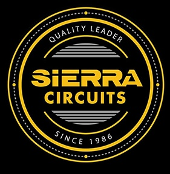
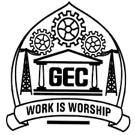

  

  

<h2>Data to Decisions</h2>

I am a Master’s in Information Systems student at the <b>Robert H. Smith School of Business, University of Maryland</b>, focused on building a career at the intersection of <b>data analytics, business intelligence, machine learning, database systems, and business process analysis</b>.

My work sits at the intersection of <b>data, business, and technology</b>. I enjoy taking messy datasets, unclear workflows, and open-ended business problems, then turning them into structured analysis, models, dashboards, system designs, and decision-support workflows.

Before graduate school, I worked as a <b>Project Engineer at Sierra Circuits</b>, where I contributed to PCB engineering platforms, backend APIs, workflow automation, validation systems, and UI-driven productivity improvements. That experience gave me a strong foundation in engineering data, technical validation, product workflows, and cross-functional problem solving.

<table>
<tr><td><b>What I bring</b></td><td>Data analytics, business analysis, SQL, Python, machine learning, database design, workflow automation, and systems thinking.</td></tr>
<tr><td><b>How I work</b></td><td>I connect problem framing, requirements, data preparation, analysis, technical implementation, validation, and business impact.</td></tr>
<tr><td><b>Career direction</b></td><td>Data Analyst, Business Analyst, Business Intelligence Analyst, Product Analyst, Data Science, and AI / analytics product-focused roles.</td></tr>
</table>

  

<h2>Current Focus</h2>

<table>
<tr>
<td width="50%"><h3> Analyze</h3>Working with structured and messy datasets to uncover patterns, evaluate performance, and support better business decisions.</td>
<td width="50%"><h3> Build</h3>Building applied projects across SQL, Python, machine learning, business intelligence, database design, and AI-assisted workflows.</td>
</tr>
<tr>
<td width="50%"><h3> Teach</h3>Supporting graduate-level instruction as a Teaching Assistant for Data Mining and Predictive Analytics.</td>
<td width="50%"><h3> Lead</h3>Leading data-backed research, analysis, and stakeholder-facing work through the Impact Consulting Fellowship.</td>
</tr>
</table>

  

<h2>Skill Map</h2>

<table>
<tr><td><b>Data Analytics</b></td><td>Python · SQL · Excel · EDA · Data Cleaning · Data Validation · KPI Analysis · Trend Analysis · Hypothesis Testing · Business Recommendations</td></tr>
<tr><td><b>Machine Learning</b></td><td>Scikit-learn · XGBoost · Logistic Regression · Decision Trees · Random Forest · kNN · Classification · Regression · AUC/ROC · Model Evaluation</td></tr>
<tr><td><b>Data Processing</b></td><td>Pandas · NumPy · Feature Engineering · Missing Value Handling · Categorical Encoding · TF-IDF · SVD · Data Pipelines</td></tr>
<tr><td><b>SQL & Databases</b></td><td>SQL · Joins · CTEs · Aggregations · Window Functions · SQL Server · MySQL · DBMS · ER Modeling · Normalization · Database Design</td></tr>
<tr><td><b>Visualization & BI</b></td><td>Power BI · Matplotlib · Seaborn · Dashboard Development · Reporting · Data Storytelling · Business Intelligence</td></tr>
<tr><td><b>Engineering & Automation</b></td><td>Java · Python · FastAPI · Spring Boot · REST APIs · API Development · Workflow Automation · Postman · Git · GitHub</td></tr>
<tr><td><b>Business & Systems</b></td><td>Business Analysis · Requirements Gathering · User Stories · ERD · DFD · CRUD Matrix · Process Flows · MVP Planning · Technical Documentation</td></tr>
</table>

  

<h2>Featured Work</h2>

<table>
<tr><th>Project</th><th>Focus Area</th><th>Business / Technical Value</th><th>Skills Used</th></tr>
<tr><td><b>Airbnb Rating Prediction</b></td><td>Machine Learning, Feature Engineering</td><td>Built an end-to-end classification pipeline using 100K+ listings, 50+ engineered features, and model evaluation to predict perfect listing ratings.</td><td>Python, Pandas, Scikit-learn, XGBoost, TF-IDF, SVD</td></tr>
<tr><td><b>Terp Protect</b></td><td>Public Safety Analytics, Database Design</td><td>Built an end-to-end platform that organizes 5,659 incident records and 1,175 arrest records into a structured database and interactive dashboard for analyzing safety patterns, reporting delays, case outcomes, arrest activity, and data quality.</td><td>Python, SQL, SQLite, Streamlit, Pandas, Plotly, ETL, Data Quality</td></tr>
<tr><td><b>Financial Portfolio Optimization</b></td><td>Python, Finance Analytics</td><td>Built a risk-aware portfolio analytics framework using trading strategies, Monte Carlo simulation, and risk-return evaluation.</td><td>Python, Pandas, NumPy, Matplotlib, Portfolio Optimization</td></tr>
<tr><td><b>SSAA Workforce Scheduling Platform</b></td><td>Business Analysis, System Design</td><td>Led systems analysis, client requirement translation, workflow modeling, and MVP planning for a construction workforce scheduling platform.</td><td>Requirements, ERD, DFD, CRUD Matrix, Workflow Design</td></tr>
<tr><td><b>TriageIQ</b></td><td>AI Product, ML, NLP</td><td>Built a human-in-the-loop support ticket triage workflow for priority prediction, routing, SLA risk scoring, and response drafting.</td><td>Python, ML, NLP, Streamlit, Product Logic</td></tr>
<tr><td><b>Drone-Based Human Drowning Detection</b></td><td>Computer Vision, Python</td><td>Developed a drone-based computer vision system to detect swimmer distress and support faster incident identification.</td><td>Python, OpenCV, YOLOv8, Image Processing</td></tr>
</table>

  

<h2>Project Highlights</h2>

<b>Terp Protect — Campus Public Safety Analytics Platform</b>

 

Terp Protect transforms public UMPD incident and arrest records from 2023–2025 into a structured database and interactive dashboard for clearer campus safety analysis.

<b>Core work</b>
<ul>
<li>Processed 5,659 incident records and 1,175 arrest records through an automated Python pipeline.</li>
<li>Designed a normalized SQLite database with reusable SQL views and incident-to-arrest matching.</li>
<li>Built a Streamlit dashboard covering time trends, locations, outcomes, reporting delays, arrests, and data quality.</li>
<li>Standardized crime, location, disposition, and charge categories for consistent reporting.</li>
</ul>
<b>Impact</b>
<ul>
<li>Improved visibility into high-activity periods, locations, and incident categories.</li>
<li>Reduced manual analysis through a repeatable end-to-end workflow.</li>
<li>Achieved a 99.94% primary field-check pass rate while retaining flagged records for review.</li>
</ul>
<b>Tools and concepts</b> 
Python, SQL, SQLite, Streamlit, Pandas, Plotly, ETL, database design, data quality, business analysis

<b>TriageIQ — AI-Powered Support Ticket Triage</b>

 

TriageIQ is an AI-assisted decision-support workflow for IT and customer support teams. The system analyzes incoming support tickets and helps agents evaluate priority, routing, SLA risk, and first-response drafting.

<b>Core capabilities</b>
<ul>
<li>Predicts whether a ticket is High, Needs Review, or Normal priority.</li>
<li>Recommends routing to the appropriate support group.</li>
<li>Scores SLA risk using transparent business rules.</li>
<li>Generates a first-response draft for human review.</li>
<li>Keeps the final decision with the agent instead of fully automating sensitive actions.</li>
</ul>
<b>Impact</b>
<ul>
<li>Designed a human-in-the-loop AI workflow for responsible decision support.</li>
<li>Connected ML predictions with operational triage logic and product usability.</li>
<li>Built a prototype to demonstrate the end-to-end support workflow.</li>
</ul>
<b>Tools and concepts</b> 
Python, machine learning, NLP, Streamlit, classification, routing logic, SLA risk scoring, AI product thinking

<b>SSAA — Workforce Scheduling Platform</b>

 

SSAA is a client-facing systems analysis and product planning project focused on improving subcontractor scheduling, workforce availability, and project coordination in construction operations.

<b>Core work</b>
<ul>
<li>Served as a primary project contact and helped maintain project direction, communication, and team coordination.</li>
<li>Translated client requirements into structured workflows, use cases, system logic, and documentation.</li>
<li>Designed DFDs, ERDs, CRUD matrices, role-based access flows, and scheduling workflows.</li>
<li>Modeled users, projects, assignments, availability, notifications, subscriptions, and payment-related entities.</li>
<li>Supported MVP planning, onboarding strategy, mobile-first workflow design, and scalability considerations.</li>
</ul>
<b>Impact</b>
<ul>
<li>Improved clarity around manpower planning, scheduling, project assignments, and workforce visibility.</li>
<li>Converted stakeholder needs into structured system requirements.</li>
<li>Demonstrated business analysis, leadership, systems thinking, and product-oriented problem solving.</li>
</ul>
<b>Tools and concepts</b> 
Business analysis, systems analysis, requirements gathering, ERD, DFD, CRUD matrix, workflow design, MVP planning, client communication

<b>Airbnb Rating Prediction — End-to-End Machine Learning Pipeline</b>

 

This project predicts whether an Airbnb listing will receive a perfect rating by using structured listing attributes, host behavior, pricing, availability, and text-based features.

<b>Core work</b>
<ul>
<li>Processed 100K+ training listings and 12K+ test listings.</li>
<li>Engineered 50+ structured and text-based features.</li>
<li>Used TF-IDF and SVD to transform listing descriptions into model-ready features.</li>
<li>Compared Logistic Regression, Decision Tree, kNN, Random Forest, and XGBoost models.</li>
<li>Used structured validation and model evaluation to improve reliability.</li>
</ul>
<b>Impact</b>
<ul>
<li>Achieved 0.828 AUC using XGBoost.</li>
<li>Identified rating drivers such as pricing, availability, host behavior, and listing content.</li>
<li>Translated model outputs into decision-focused insights for host and platform optimization.</li>
</ul>
<b>Tools and concepts</b> 
Python, Pandas, NumPy, Scikit-learn, XGBoost, TF-IDF, SVD, feature engineering, classification, AUC/ROC

<b>Financial Portfolio Optimization — Python Analytics</b>

 

This project evaluates trading strategies and constructs an optimized investment portfolio using Python, risk-return analysis, and simulation techniques.

<b>Core work</b>
<ul>
<li>Converted historical price data into daily return series.</li>
<li>Built Moving Average Crossover and Bollinger Band strategy logic.</li>
<li>Created an 8-strategy portfolio across multiple instruments.</li>
<li>Used correlation analysis, Monte Carlo simulation, and mean-variance optimization.</li>
<li>Evaluated return, volatility, Sharpe Ratio, maximum drawdown, and beta.</li>
</ul>
<b>Impact</b>
<ul>
<li>Improved Sharpe Ratio from 1.02 to 1.22.</li>
<li>Reduced portfolio volatility through better allocation.</li>
<li>Demonstrated risk-aware decision-making instead of return-only evaluation.</li>
</ul>
<b>Tools and concepts</b> 
Python, Pandas, NumPy, Matplotlib, financial analytics, portfolio optimization, Monte Carlo simulation, risk analysis

<b>Drone-Based Human Drowning Detection</b>

 

This engineering capstone project used drone-based image processing to support faster identification of swimmers in distress.

<b>Core work</b>
<ul>
<li>Developed a Python, OpenCV, and YOLOv8-based detection workflow.</li>
<li>Combined computer vision, hardware integration, and real-time monitoring concepts.</li>
<li>Worked through model experimentation, hardware/software integration, testing, troubleshooting, and final demonstration.</li>
<li>Gained hands-on exposure to object detection, image processing, drone behavior, and real-time application development.</li>
</ul>
<b>Impact</b>
<ul>
<li>Achieved 93% detection accuracy.</li>
<li>Demonstrated how computer vision can support safety-focused monitoring use cases.</li>
<li>Built resilience through iterative testing, debugging, and real-world technical constraints.</li>
</ul>
<b>Tools and concepts</b> 
Python, OpenCV, YOLOv8, computer vision, object detection, image processing, hardware/software integration

  

<h2>Experience</h2>

<table>
<tr>
<td>
<table>
<tr><td width="150" align="center" valign="middle"></td><td width="650" valign="middle"><h3>Teaching Assistant — Data Mining & Predictive Analytics</h3><b>University of Maryland, Robert H. Smith School of Business</b> May 2026 – Present · College Park, Maryland</td></tr>
</table>

Support graduate-level instruction for Data Mining and Predictive Analytics, helping students apply statistical and machine learning concepts to real-world business problems.

<b>Contributions:</b>
<ul>
<li>Teach and facilitate class sessions covering predictive modeling, linear regression, logistic regression, classification, K-Nearest Neighbors, Naive Bayes, and model evaluation.</li>
<li>Guide students in interpreting analytical outputs, evaluating model performance, and connecting technical results to business decision-making.</li>
<li>Grade quizzes, assignments, and discussion activities while providing structured feedback to improve analytical thinking and technical accuracy.</li>
<li>Review student submissions to identify grading discrepancies, assessment issues, and opportunities to improve rubric clarity.</li>
<li>Maintain grading documentation and support fair, consistent evaluation across course deliverables.</li>
</ul>
</td>
</tr>
<tr>
<td>
<table>
<tr><td width="150" align="center" valign="middle"></td><td width="650" valign="middle"><h3>Team Lead — Impact Consulting Fellowship</h3><b>Center for Social Value Creation, Robert H. Smith School of Business</b> Summer 2026 · College Park, Maryland</td></tr>
</table>

Selected as Team Lead for a client-facing analytics and strategy project with the Town of Cheverly focused on economic development, industrial growth, and data-driven decision-making.

<b>Contributions:</b>
<ul>
<li>Lead project planning, research coordination, stakeholder communication, and deliverable development for a municipal strategy engagement.</li>
<li>Gather and analyze market, economic, demographic, and industry data to evaluate opportunities for Cheverly’s industrial corridor.</li>
<li>Conduct secondary research and competitive benchmarking across hard-tech innovation, reindustrialization, industrial districts, and regional development models.</li>
<li>Translate complex business, market, and policy information into structured analytical frameworks, insights, and recommendations.</li>
<li>Synthesize qualitative and quantitative findings into executive-level presentations and reports for municipal stakeholders.</li>
</ul>
</td>
</tr>
<tr>
<td>
<table>
<tr><td width="150" align="center" valign="middle"></td><td width="650" valign="middle"><h3>Project Engineer</h3><b>Sierra Circuits</b> Aug 2023 – Aug 2025 · Goa, India</td></tr>
</table>

Worked on internal PCB engineering platforms focused on workflow automation, data processing, backend APIs, validation systems, and UI-driven productivity improvements.

<b>Contributions:</b>
<ul>
<li>Developed APIs to import Excel-based PCB stackup tables into structured database systems, reducing manual data entry effort by 70%.</li>
<li>Validated and corrected 800+ PCB stackup records by reviewing material construction, PCB thickness values, and engineering parameters to improve accuracy and reliability.</li>
<li>Enhanced Stackup Tool filtering, display logic, and UI/UX workflows, reducing user task completion time by 40%.</li>
<li>Built and optimized impedance calculator logic in Java, then supported migration into Python for better maintainability, performance, and scalability.</li>
<li>Researched and improved BOM Builder tool behavior by analyzing dynamic UI settings, workflow gaps, and usability issues.</li>
<li>Built secure backend APIs for an internal S3 Bucket application, improving daily file upload and access efficiency by 25%.</li>
<li>Conducted end-to-end testing, validation, reporting, and documentation across multiple internal engineering applications.</li>
<li>Collaborated with cross-functional teams to gather requirements, define user stories, and support scalable frontend/backend tool development.</li>
</ul>
</td>
</tr>
<tr>
<td>
<table>
<tr><td width="150" align="center" valign="middle"></td><td width="650" valign="middle"><h3>Process Automation Intern</h3><b>Sierra Circuits</b> Aug 2022 – Oct 2022 · Goa, India</td></tr>
</table>

Worked on Robotic Process Automation initiatives focused on automating repetitive engineering workflows, web-based calculations, data extraction, and validation tasks.

<b>Contributions:</b>
<ul>
<li>Developed automation workflows using UI Vision RPA and Selenium-based scripting for engineering and data-processing tasks.</li>
<li>Built RPA workflows for PCB impedance and trace-width calculators, improving consistency in engineering calculations.</li>
<li>Automated extraction and storage of operational data into CSV-based outputs for reporting, analysis, and tracking.</li>
<li>Implemented loop-based automation logic to support repeated calculations across changing input values.</li>
<li>Worked with PCB stackup, impedance, trace width, current capacity, and temperature-rise concepts to support engineering process automation.</li>
<li>Tested, debugged, and optimized automation scripts to improve workflow reliability.</li>
</ul>
</td>
</tr>
</table>

  

<h2>Leadership & Involvement</h2>

<table>
<tr>
<td>
<table>
<tr><td width="150" align="center" valign="middle"></td><td width="650" valign="middle"><h3>SMSA Student Ambassador</h3><b>Robert H. Smith School of Business</b> 2026 – Present</td></tr>
</table>

Support student engagement, peer communication, networking initiatives, and collaboration across graduate business programs.

This role helps me strengthen communication, event coordination, student engagement, and cross-functional collaboration in a diverse graduate business environment.

</td>
</tr>
<tr>
<td>
<h3>School Leadership</h3>

<b>Cultural Secretary and Class Representative</b>

Organized major school events, coordinated student participation, managed event logistics, supported assemblies and cultural programs, and contributed to community-focused outreach initiatives.

This early leadership experience helped shape my foundation in ownership, communication, responsibility, empathy, and team coordination.

</td>
</tr>
</table>

  

<h2>Education</h2>

<table>
<tr>
<td>
<table>
<tr><td width="150" align="center" valign="middle"></td><td width="650" valign="middle"><h3>Master of Science in Information Systems</h3><b>University of Maryland, Robert H. Smith School of Business</b> Aug 2025 – Dec 2026</td></tr>
</table>

<b>Scholarship:</b> Terrapin Scholarship Recipient

<b>Focus:</b> Data Analytics, Business Intelligence, Machine Learning, Database Systems, Business Process Analysis, AI for Business, and Digital Transformation.

<b>Relevant Coursework:</b> Data Mining and Predictive Analytics · Data Processing & Analysis in Python · Database Management Systems · Business Process Analysis · AI for Business · Digital Transformation in Business · Project Management

<b>Applied Work:</b> SQL-based database design, Python analytics, predictive modeling, feature engineering, data visualization, and business decision support.

</td>
</tr>
<tr>
<td>
<table>
<tr><td width="150" align="center" valign="middle"></td><td width="650" valign="middle"><h3>Bachelor of Engineering in Electronics and Telecommunications</h3><b>Goa College of Engineering</b> 2019 – 2023</td></tr>
</table>

<b>Foundation:</b> Electronics, telecommunications, programming, automation, embedded systems concepts, computer vision, and engineering problem-solving.

<b>Final Year Project:</b> Developed a drone-based human drowning detection system using Python, OpenCV, and YOLOv8, combining computer vision, hardware integration, and real-time detection workflows.

Worked across the project lifecycle, including research, system planning, model experimentation, hardware/software integration, testing, troubleshooting, and final demonstration.

</td>
</tr>
</table>

  
<!--
<h2>Certifications</h2>

<table>
<tr>
<td><b>The Joy of Computing using Python</b></td>
<td>NPTEL / IIT Madras</td>
</tr>
</table>

  
-->
<h2>What I’m Looking For</h2>

I am currently exploring opportunities where I can apply <b>data analysis, business intelligence, machine learning, SQL, Python, and systems thinking</b> to solve real business problems.

<table>
<tr><td><b>Target roles</b></td><td>Data Analyst · Business Analyst · Business Intelligence Analyst · Product Analyst · Data Science Intern / Analyst · AI / Analytics Product-focused roles</td></tr>
<tr><td><b>Ideal work</b></td><td>Roles involving data analysis, dashboards, SQL, Python, predictive modeling, business insights, requirements gathering, and cross-functional problem solving.</td></tr>
</table>

  

Continuously building work that connects business understanding, analytical thinking, and practical data-driven execution.

